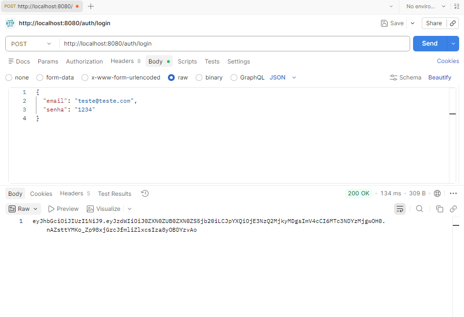

# 🚀 DevTasks API

API REST desenvolvida com **Java e Spring Boot** para gerenciamento de tarefas, com autenticação de usuários utilizando **JWT (JSON Web Token)**.

Este projeto foi criado com foco em práticas de desenvolvimento backend, incluindo construção de endpoints REST, integração com banco de dados e autenticação segura.

---

## 📌 Funcionalidades

* ✅ Cadastro de usuários
* ✅ Login com autenticação
* ✅ Geração de token JWT
* ✅ CRUD de tarefas
* ✅ Integração com banco de dados relacional (MySQL)

---

## 🛠️ Tecnologias e Ferramentas

* Java 21
* Spring Boot
* Spring Data JPA
* MySQL
* JWT (Json Web Token)
* Lombok
* Maven
* Postman

---

## 🔐 Autenticação com JWT

A autenticação da API é baseada em **token JWT**, retornado após login válido.

### 📍 Endpoint:

```http
POST /auth/login
```

### 📥 Requisição:

```json
{
  "email": "teste@teste.com",
  "senha": "1234"
}
```

### 📤 Resposta (200 OK):

```json
"eyJhbGciOiJIUzI1NiIsInR5cCI6IkpXVCJ9..."
```

---

## 📸 Teste no Postman



> 💡 Substitua essa imagem por um print real do seu Postman testando o `/auth/login`

---

## 📂 Estrutura do Projeto

```
controller   → Endpoints REST
dto          → Entrada e saída de dados
model        → Entidades JPA
repository   → Acesso ao banco de dados
service      → Regras de negócio
security     → Autenticação e JWT
```

---

## ⚙️ Como executar o projeto

### 1. Clone o repositório

```bash
git clone https://github.com/seu-usuario/devtasks.git
```

### 2. Configure o banco de dados

```properties
spring.datasource.url=jdbc:mysql://localhost:3306/devtasks
spring.datasource.username=root
spring.datasource.password=sua_senha
spring.jpa.hibernate.ddl-auto=update
```

### 3. Execute a aplicação

```bash
./mvnw spring-boot:run
```

---

## 🧪 Testes

Os testes dos endpoints foram realizados utilizando o **Postman**, validando:

* Autenticação de usuários
* Retorno de status HTTP corretos
* Geração de token JWT

---

## 📈 Competências demonstradas

* Desenvolvimento de APIs REST
* Implementação de autenticação com JWT
* Escrita de queries simples com JPA
* Integração com banco de dados
* Organização em arquitetura em camadas
* Teste de APIs com Postman

---

## 👨‍💻 Autor

**Vinicius**
Estudante de Análise e Desenvolvimento de Sistemas
🔗 (coloque aqui o link do seu LinkedIn)
🔗 (coloque aqui o link do seu GitHub)
